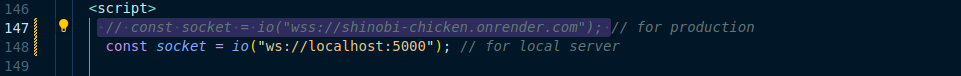
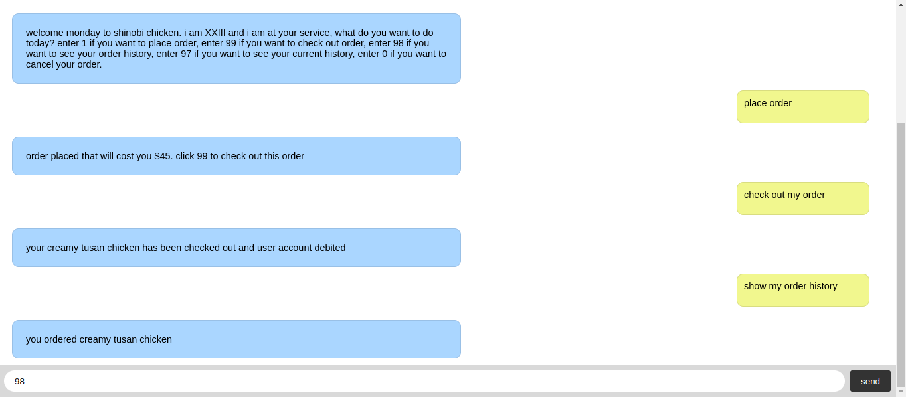

# XXIII ordering bot

XXIII ordering bot is a chat bot for a fictional resturant - shinobi chickens. the bot makes it possible for users to order mutiple chicken meals, check out the order, view their order history or just their current order and also cancel the order. fun right ?

# stack or technologies 
nodeJS
express
socketIO

# Setup
* Clone the Repo 
* change directory `cd  XXIII-ordering-bot`
* Run `npm install`

# Run the Application
* first comment the the index.html line 147 and uncomment the line 148 because you want run the app on your local server not an hosted server.

*Start the application by running `nodemon index.js` then visit the application on browser  http://localhost:5000

* Enter 1-> to place an order (the bot will provide a form, there you enter an order and quantity according to menu ),99-> to check out order place,98-> to see the entire orders for the session,97-> to see your current order or 0-> to cancel order`

# Contact

- GitHub [@techrook](https://{github.com/techrook})
- Twitter [@itohowo23](https://{twitter.com/itohowo23})
